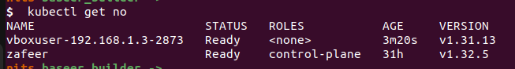

# Multi machine worker nodes into master node.

## tl;dr
Add multiple worker nodes into kubernetes cluster simultaneously with bare minimum work.

### Prerequisites

#### Worker

1. All worker nodes have been added to sudo list.
2. Worker Nodes must be ubuntu machine, although we have not tested with other OSes.
3. Python installed.


#### Master

1. Kubernetes cluster already initalized using kubeadm and healthy.
2. kubeconfig file is present with current users context.
3. All machines are in same network.
4. Master can ssh into each machine with/without password.

### Steps -- On master node
1. git clone <repo>/join-worker
2. cd repo
3. uv sync
4. source venv/bin/activate
5. Open ```hosts.ini``` file. and replce master and worker nodes with correct IPs, host names, and passwords.

```
[workers]
192.168.1.6 ansible_user=vboxuser1 ansible_ssh_pass=ssh_pass ansible_become_pass=sudo_pass
192.168.1.3 ansible_user=vboxuser2 ansible_ssh_pass=ssh_pass ansible_become_pass=sudo_pass

[master]
192.168.1.13 ansible_user=""
```

Add as many workers as required.

6. Run the following command to initilize the playbook

```
cd ./ansible
ansible-playbook -i hosts.ini join-worker.yml -K  -v
```

This will prompt for password of master node machine.

After all these steps you should be able to join worker nodes to master node(s).


## What this will do.

1. Ensure master node has active production grade kubeadm kubernetes cluster.
2. Create token and hash using kubeconfig present with current user.
3. Few checks on each worker weather all components required by kubernetes installed or not.
4. Add worker to master with a unique node name.

Note: Unique node is acheived by appending the linux username with random number ensuring in case of clash worker doesn't fail to join master. 

